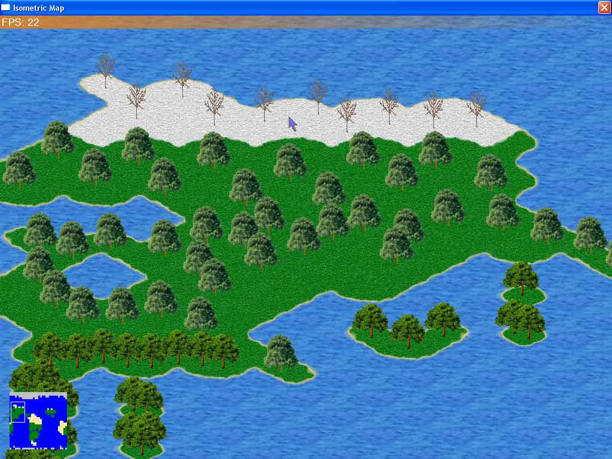

## A Simple Way to Draw an Isometric Map

### Description

This program draws an isometric map in very few lines of code. This also includes tile transitions, animated tiles, minimap, alphablended color cursors, camera scrolling, and more! Download it and see for yourself!
 
### More Info
 

             |
---                |---
**Submitted On**   |2003-07-29 21:13:10
**By**             |[\_andy\_](https://github.com/Planet-Source-Code/PSCIndex/blob/master/ByAuthor/andy.md)
**Level**          |Intermediate
**User Rating**    |5.0 (20 globes from 4 users)
**Compatibility**  |VB 5\.0, VB 6\.0
**Category**       |[Graphics](https://github.com/Planet-Source-Code/PSCIndex/blob/master/ByCategory/graphics__1-46.md)
**World**          |[Visual Basic](https://github.com/Planet-Source-Code/PSCIndex/blob/master/ByWorld/visual-basic.md)
**Archive File**   |[A\_Simple\_W1621397292003\.zip](https://github.com/Planet-Source-Code/andy-a-simple-way-to-draw-an-isometric-map__1-47248/archive/master.zip)

